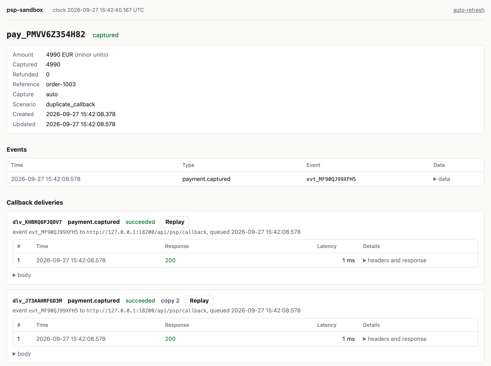

# psp-sandbox

[](https://github.com/IanFoxDev/psp-sandbox/actions/workflows/go.yml)
[](https://github.com/IanFoxDev/psp-sandbox/actions/workflows/php.yml)
[](https://github.com/IanFoxDev/psp-sandbox/releases)
[](https://packagist.org/packages/ianfoxdev/psp-sandbox-php)

A fake payment provider for tests and CI that fails the way real providers do.

Real PSP sandboxes are built to show the happy path. Money gets lost somewhere else:
the same callback arrives three times, the callback arrives before the HTTP response to
"create payment", the request times out on your side while the payment succeeds on theirs,
a refund comes back before the capture. None of this can be triggered on demand in a
vendor sandbox, so this code usually ships untested.

psp-sandbox is a single Docker container that speaks a simple PSP-style API, sends signed
callbacks to your app, and lets each test pick a failure scenario by name. With
`PSP_PROFILE=stripe` it speaks Stripe's API instead, so code on the official Stripe SDK
gets the same failures without an adapter.

> Status: v0.4. Until 1.0, a minor version may change the API; such changes are marked
> **BREAKING** in the [CHANGELOG](CHANGELOG.md).

## Quick start

```yaml
# compose.yaml in your project
services:
  psp:
    image: ghcr.io/ianfoxdev/psp-sandbox:0.4
    ports: ["8090:8090"]
    environment:
      PSP_CALLBACK_URL: http://app/api/psp/callback
      PSP_WEBHOOK_SECRET: whsec_dGVzdC1zZWNyZXQ=
```

Create a payment and ask for a duplicate callback:

```bash
curl -s localhost:8090/v1/payments \
  -H 'Content-Type: application/json' \
  -H 'Idempotency-Key: order-42' \
  -H 'X-Sandbox-Scenario: duplicate_callback; times=3' \
  -d '{"amount": 1000, "currency": "EUR", "reference": "order-42"}'
```

The image has a Docker healthcheck, so the app can wait for
`depends_on: { psp: { condition: service_healthy } }`.

Your app now receives the same `payment.captured` event three times, each one signed.
If your handler credits the order three times, the test catches it before production does.

Open http://localhost:8090/_sandbox/ to see every payment and every callback attempt:
what was sent, what your app answered, how long it took.

<picture>
  <source media="(prefers-color-scheme: dark)" srcset="docs/images/ui-payment-dark.png">
  
</picture>

## Code that calls Stripe

Start the sandbox with `PSP_PROFILE=stripe` and point the SDK at it. Nothing else in
the app changes: PaymentIntents, 3DS, Checkout Sessions, refunds, events and webhooks
signed with `Stripe-Signature` behave like Stripe's, checked against Stripe's OpenAPI
spec and with stripe-php, stripe-go and stripe-node in CI.

```php
$stripe = new \Stripe\StripeClient(['api_key' => 'sk_test_123', 'api_base' => 'http://localhost:8090']);
$stripe->paymentIntents->create([
    'amount' => 1000, 'currency' => 'eur', 'confirm' => true, 'payment_method' => 'pm_card_visa',
    'metadata' => ['order_id' => '42', 'sandbox_scenario' => 'duplicate_callback; times=3'],
]);
```

The webhook handler gets `payment_intent.succeeded` three times, each with a valid
`Stripe-Signature`. Stripe's test cards work as they do in test mode
(`pm_card_visa_chargeDeclinedInsufficientFunds` is a `402` card error), and every
scenario below can be picked through metadata.

Checkout and 3DS send the customer to pages of the sandbox instead of Stripe's, so a
browser test can pay, pass or fail 3DS and come back to `success_url` or `return_url`.
A test without a browser does the same through the control API.

Setup for each SDK, what is supported and how it differs from Stripe:
[docs/stripe.md](docs/stripe.md). Running the SDKs against the sandbox also showed that
stripe-go does not retry `5xx` answers and that stripe-php retries POSTs without an
idempotency key unless retries are on globally; details there.

## Scenarios

| Scenario | What happens | |
|---|---|---|
| `happy_path` | Payment is captured, one callback. Default. | v0.1 |
| `declined` | Payment fails with a decline reason. | v0.1 |
| `duplicate_callback` | The same event is delivered N times, sequentially or in parallel. | v0.1 |
| `callback_before_response` | The callback is sent before the HTTP response to create. | v0.1 |
| `timeout_then_success` | The create request hangs past your client timeout, the payment still succeeds. | v0.1 |
| `lost_callback` | No callback is ever sent. Only polling tells you the result. | v0.1 |
| `delayed_callback` | The callback arrives after a configurable delay. | v0.1 |
| `chargeback_after` | A chargeback is opened some time after capture and closed as lost or won. | v0.2 |
| `server_error_then_success` | The first N create requests return 5xx and create nothing, the next one succeeds. | v0.2 |
| `out_of_order` | Events for one payment arrive in reverse order. | v0.2 |
| `three_d_secure` | The payment waits for 3DS on a sandbox page, then succeeds or fails. | v0.4 |
| `invalid_signature` | The callback carries a wrong, stale or missing signature. | v0.4 |
| `ack_ignored` | Your app returns 200, the sandbox retries anyway. | v0.4 |
| `amount_mismatch` | The captured amount differs from the requested one. | v0.4 |
| `status_regression` | A failed callback arrives after the payment succeeded. | v0.4 |

Parameters and exact behavior: [docs/scenarios.md](docs/scenarios.md).

Scenarios can also be picked without headers, by rules on amount or reference, so tests
that go through your real checkout code do not need to know about the sandbox:

```yaml
# scenarios.yaml
rules:
  - when: { amount: 1313 }
    scenario: declined
  - when: { reference_prefix: "dup-" }
    scenario: duplicate_callback
    params: { times: 3 }
```

## PHP client

```bash
composer require --dev ianfoxdev/psp-sandbox-php guzzlehttp/guzzle
```

Guzzle is only an example: any PSR-18 client already in the project works, Symfony
HttpClient with `nyholm/psr7` included.

```php
use PspSandbox\Client;
use PspSandbox\Scenario;
use PspSandbox\Webhook\Verifier;

// verify callbacks in your app the same way you would for a real provider
(new Verifier($secret))->verify($body, $headers);

// in a test: pick a scenario, then wait for the callbacks
$sandbox = new Client('http://psp:8090');
$payment = $sandbox->createPayment(1000, 'EUR', reference: 'order-42',
    scenario: Scenario::DuplicateCallback, scenarioParams: ['times' => 3]);
$deliveries = $sandbox->waitForDeliveries($payment->id, count: 3);
```

A PHPUnit trait (`InteractsWithSandbox`) adds `waitForDeliveries()` and
`waitForPaymentStatus()` that fail the test on timeout.

Tests that run in parallel against one sandbox (paratest, several CI jobs) give each
test a reference prefix and reset only that, instead of the whole sandbox:

```php
$prefix = 'test-' . bin2hex(random_bytes(4)) . '-';
$this->resetSandbox($prefix);
$payment = $this->sandbox()->createPayment(1000, 'EUR', reference: $prefix . 'order-1');
```

Details and limits: [Parallel tests](docs/api.md#parallel-tests).

The PHP package lives in [clients/php](clients/php) and is published as a separate
read-only repository.

## Other languages

The API is plain JSON over HTTP, so a test in Go, Node or Python can call it with any
HTTP client. [docs/openapi.yaml](docs/openapi.yaml) describes both APIs and the callback
(OpenAPI 3.1), for generating a client or loading into Postman or Bruno. Callbacks use
Standard Webhooks signing, which has verifier libraries for most languages.

## Examples

[examples/](examples) has a Laravel and a Symfony shop, each with a naive and a safe
callback handler. The same tests pass on the safe one and fail on the naive one: five
parallel copies of one callback credit the order several times, and a callback that
arrives before the create response leaves the order unpaid. The Laravel shop also pays
through Stripe Checkout, where the naive handler fulfills the order on the success page
and loses it when the customer closes the tab.

## Where callbacks go

`PSP_CALLBACK_URL` is the default target. A payment created with `callback_url` in the
body gets its callbacks there instead.

- App in the same compose file: use the service name, `http://app:8000/...`.
- App running on your machine, sandbox in Docker: `http://host.docker.internal:8000/...`.
  On Linux add `extra_hosts: ["host.docker.internal:host-gateway"]` to the sandbox
  service.
- Neither set: events are recorded but nothing is sent. The sandbox warns about it at
  startup.

## Configuration

Everything is set with environment variables. The ones most tests need:

| Variable | Default | |
|---|---|---|
| `PSP_CALLBACK_URL` | empty | Where callbacks go. |
| `PSP_WEBHOOK_SECRET` | random | Signing secret. Set it, or your verifier rejects every callback. |
| `PSP_SCENARIOS_FILE` | empty | Rules that pick a scenario by amount, currency, reference or metadata. |
| `PSP_RETRY_SCHEDULE` | `0s,5s,30s,2m,10m,1h` | `0s` in CI: one attempt, no hour-long retries. |
| `PSP_CLOCK` | `real` | `manual` to move time from tests (chargebacks, long delays). |

The full list: [docs/api.md](docs/api.md#configuration). Recipes for GitHub Actions and
GitLab CI services, including how callbacks get back to the job:
[docs/ci.md](docs/ci.md).

## Callbacks

Callbacks follow the [Standard Webhooks](https://www.standardwebhooks.com/) signing
scheme (`webhook-id`, `webhook-timestamp`, `webhook-signature` headers), so any Standard
Webhooks library can verify them. Failed deliveries are retried with backoff. Every
delivery attempt is visible in the web UI at `/_sandbox/` and through the control API.
Details: [docs/callbacks.md](docs/callbacks.md).

## Control API

Tests talk to `/_sandbox/*` to inspect and drive the sandbox: list deliveries for a
payment, replay a callback, open a chargeback by hand, move the clock forward, reset
state between tests (all of it, or one test's payments by reference prefix, so tests
can run in parallel). See [docs/api.md](docs/api.md#control-api).

## Documentation

- [API](docs/api.md), and the same as [OpenAPI 3.1](docs/openapi.yaml)
- [Stripe-compatible profile](docs/stripe.md), with Checkout and 3DS
- [Running in CI](docs/ci.md)
- [Scenarios](docs/scenarios.md)
- [Callbacks and signing](docs/callbacks.md)
- [Architecture](docs/architecture.md)
- [Decision records](docs/adr)

## Contributing

New failure scenarios are the most useful contribution. If your team lost money or
time to a provider behavior that is not in the list, open an issue with the
"Scenario request" template. See [CONTRIBUTING.md](CONTRIBUTING.md).

## License

[MIT](LICENSE)
