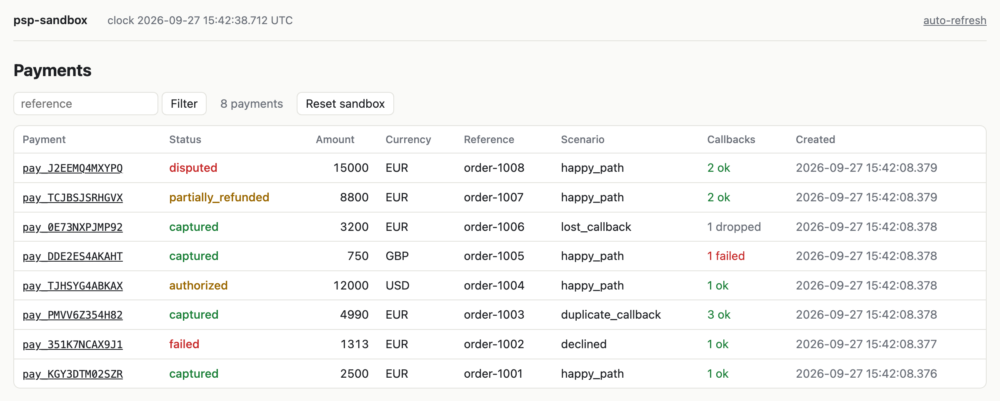

# API

The sandbox exposes two APIs on the same port (default `8090`):

- **Provider API** (`/v1/*`): what your application calls, shaped like a typical card
  acquirer.
- **Control API** (`/_sandbox/*`): what your tests call to inspect and drive the sandbox.

All bodies are JSON. Amounts are integers in minor units (`1000` EUR means 10.00 EUR).
Currency is an uppercase code of 3 to 5 characters (`EUR`, `JPY`, `USDT`). The sandbox
does not convert or round amounts, so the minor unit is whatever your application uses.

## Authentication

`Authorization: Bearer <key>`. Any key is accepted unless `PSP_API_KEY` is set, in which
case only that key is. Missing or wrong key returns `401`.

## Provider API

### Create a payment

`POST /v1/payments`

Headers:

| Header | Required | Meaning |
|---|---|---|
| `Idempotency-Key` | no | Same key and same request return the stored response. See [Idempotency](#idempotency). |
| `X-Sandbox-Scenario` | no | Scenario for this payment, `name; param=value; param=value`. Overrides rules. |

Body:

```json
{
  "amount": 1000,
  "currency": "EUR",
  "reference": "order-42",
  "capture": "auto",
  "callback_url": "http://app/api/psp/callback",
  "metadata": { "customer_id": "c_1" }
}
```

- `capture`: `auto` (default) or `manual`. Manual leaves the payment `authorized` until
  a capture call.
- `callback_url`: overrides `PSP_CALLBACK_URL` for this payment.
- `reference`: your id. Not required to be unique; the sandbox does not deduplicate on it.

Response `201`:

```json
{
  "id": "pay_01J9Z3K8Q2W5",
  "status": "pending",
  "amount": 1000,
  "captured_amount": 0,
  "refunded_amount": 0,
  "currency": "EUR",
  "reference": "order-42",
  "scenario": "happy_path",
  "created_at": "2026-09-25T10:00:00Z",
  "metadata": { "customer_id": "c_1" }
}
```

The payment moves to its next status asynchronously and a callback is sent, unless the
scenario says otherwise.

Unknown fields in the body are rejected with `400`, which catches typos early.

### Idempotency

`Idempotency-Key` works on create and refund. Capture and cancel need no key: repeating
them gives `409 invalid_state`, never a second capture. A key is scoped to the
method and path, so the same key on two different payments does not clash.

- Same key, same request: the stored answer comes back with `Idempotent-Replayed: true`.
  It is the answer as it was, so it may say `pending` for a payment that is already
  captured.
- Same key, different request: `409 idempotency_conflict`. The request is compared byte
  for byte, body and `X-Sandbox-Scenario` header, so the same JSON with another key
  order or whitespace counts as different.
- Same key while the first request is still running: `409 idempotency_conflict`.
- Error answers are not stored: a retry after a `4xx` or `5xx` runs the request again.

### Get a payment

`GET /v1/payments/{id}` returns the payment object. `404` if unknown.

`GET /v1/payments?reference=order-42` returns `{"data": [ ...payments ]}`.

### Capture

`POST /v1/payments/{id}/capture` with optional `{"amount": 700}` for partial capture.
Without `amount` the full amount is captured; `0` or a negative amount is rejected.
Only from `authorized`. Returns the payment.

### Cancel

`POST /v1/payments/{id}/cancel`. Only from `pending` or `authorized`.

### Refund

`POST /v1/payments/{id}/refunds`

```json
{ "amount": 300, "reference": "refund-1" }
```

Returns a refund object `{ "id": "ref_...", "payment_id": "...", "status": "pending", "amount": 300 }`.
The refund settles after `PSP_PROCESSING_DELAY` and the result arrives as a
`refund.succeeded` callback, or `refund.failed` if the payment changed status meanwhile
(for example, a chargeback opened).
`Idempotency-Key` works the same way as for create.

### Payment statuses

```
pending -> authorized -> captured -> partially_refunded -> refunded
   |           |            |
   v           v            v
 failed     canceled     disputed -> chargeback_lost | chargeback_won
```

### Errors

```json
{ "error": { "code": "invalid_state", "message": "payment is not authorized" } }
```

| HTTP | code |
|---|---|
| 400 | `invalid_request` |
| 401 | `unauthorized` |
| 404 | `not_found` |
| 409 | `idempotency_conflict`, `invalid_state`, `clock_not_manual` (control API) |
| 422 | `amount_exceeds_captured` |
| 5xx | returned only by scenarios that ask for it |

## Control API

Not authenticated. Do not expose the sandbox outside a test network. Errors have the same
shape as in the provider API. Lists come as `{"data": [...]}`.

| Method and path | Answer | Purpose |
|---|---|---|
| `GET /_sandbox/scenarios` | `200` | Catalog: name, description, parameters with type, default and allowed values. |
| `GET /_sandbox/payments/{id}/deliveries` | `200` | Every callback delivery and its attempts, see below. |
| `GET /_sandbox/payments/{id}/events` | `200` | Events of the payment in the order they happened. |
| `POST /_sandbox/payments/{id}/events` | `201` | Force an event, see below. |
| `POST /_sandbox/deliveries/{id}/replay` | `202` | Send the event of a delivery again, as a new delivery. |
| `GET /_sandbox/clock` | `200` | `{"now": "...", "manual": true}` |
| `POST /_sandbox/clock/advance` | `200` | `{"seconds": 3600}`. Moves a manual clock, see below. |
| `POST /_sandbox/reset` | `204` | Drop all payments, events, deliveries, pending status changes and idempotency keys. |
| `GET /_sandbox/` | `200` | Web UI, see below. |
| `GET /healthz` | `200` | Liveness, `ok`. |

### Deliveries

```json
{
  "id": "dlv_7QK2M9XH4B1C",
  "event_id": "evt_01J9Z3M4T7A1",
  "event_type": "payment.captured",
  "payment_id": "pay_01J9Z3K8Q2W5",
  "url": "http://app/api/psp/callback",
  "copy": 1,
  "replay_of": "",
  "status": "succeeded",
  "created_at": "2026-09-25T10:00:00.2Z",
  "body": { "id": "evt_01J9Z3M4T7A1", "type": "payment.captured", "...": "..." },
  "attempts": [
    {
      "n": 1,
      "at": "2026-09-25T10:00:00.2Z",
      "request_headers": { "Webhook-Id": "evt_01J9Z3M4T7A1", "...": "..." },
      "status_code": 200,
      "response_body": "ok",
      "latency_ms": 4
    }
  ]
}
```

`status` is `pending`, `succeeded`, `failed` (all attempts used) or `dropped` (the
scenario never sends it, as in `lost_callback`). `copy` counts copies of one event in
`duplicate_callback`. `replay_of` is set on deliveries made by replay.

### Forced events

`POST /_sandbox/payments/{id}/events`:

```json
{ "type": "chargeback.opened" }
```

The payment moves to the status the event stands for, the event is recorded and sent
through the payment's scenario, as if the provider did it. The usual status rules apply,
so a chargeback on a pending payment returns `409 invalid_state`.

| `type` | New status | Extra fields |
|---|---|---|
| `payment.authorized` | `authorized` | |
| `payment.captured` | `captured` | |
| `payment.failed` | `failed` | `reason`, default `do_not_honor` |
| `payment.canceled` | `canceled` | |
| `chargeback.opened` | `disputed` | |
| `chargeback.closed` | `chargeback_lost` or `chargeback_won` | `outcome`: `lost` (default) or `won` |

The answer is `{"payment": {...}, "event": {...}}`. Refund events cannot be forced.

### Clock

With `PSP_CLOCK=manual` the sandbox clock starts at the wall-clock time of startup and
moves only on `POST /_sandbox/clock/advance`. Status changes that fall due are applied
before the call answers, so a `GET` right after it sees the new status. Callbacks,
delayed callbacks and retries that fall due are sent in the background right after,
one after another: one advance of an hour runs every retry scheduled within that
hour. Wait for the deliveries (`waitForDeliveries()` in the PHP client) instead of
reading them right after the call.

Without a manual clock the call returns `409 clock_not_manual`. Reset does not move the
clock back.

### Web UI

<picture>
  <source media="(prefers-color-scheme: dark)" srcset="images/ui-payments-dark.png">
  
</picture>

Open `http://localhost:8090/_sandbox/` in a browser. The list shows the newest 200
payments with status, scenario and a count of callback deliveries by status, and can be
filtered by reference. A payment page shows its fields, events with their data, and
every delivery with each attempt: request headers, response status and body, latency,
error. A delivery can be replayed from there, and the whole sandbox can be reset from
the list.

The pages are plain HTML with forms, no JavaScript. Add `?refresh=2` to any page (or
click "auto-refresh") to reload it every 2 seconds while a test runs. The UI routes
under `/_sandbox/ui/` are for the browser; tests should use the JSON endpoints above.

## Configuration

| Variable | Default | Meaning |
|---|---|---|
| `PSP_ADDR` | `:8090` | Listen address. |
| `PSP_API_KEY` | empty | If set, required bearer key. |
| `PSP_CALLBACK_URL` | empty | Default callback URL. |
| `PSP_WEBHOOK_SECRET` | random at start | `whsec_` + base64 secret for signing. Printed to the log if random. |
| `PSP_SCENARIOS_FILE` | empty | Path to a rules file, see [scenarios.md](scenarios.md). |
| `PSP_DEFAULT_SCENARIO` | `happy_path` | Scenario when neither header nor rule matches. |
| `PSP_PROCESSING_DELAY` | `200ms` | Time between create and the first status change. |
| `PSP_RETRY_SCHEDULE` | `0s,5s,30s,2m,10m,1h` | Callback retry delays. |
| `PSP_CLOCK` | `real` | `manual` enables `/_sandbox/clock/advance`. |
| `PSP_SEED` | random | Seed for ids and jitter. Same seed, same ids. |
| `PSP_LOG_FORMAT` | `text` | `text` or `json`. |
